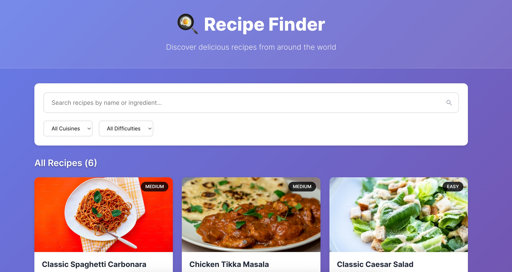

# 🍳 Recipe Finder

A modern, responsive React application for discovering and exploring delicious recipes from around the world. Built with React 19, Vite, and modern CSS, this app provides an intuitive interface for searching, filtering, and viewing detailed recipe information.

Live url: https://library-management-sigma-ten.vercel.app/



## ✨ Features

### 🔍 Smart Search

- **Real-time Search**: Search recipes by name, ingredients, or description with debounced input for optimal performance
- **Intelligent Filtering**: Find recipes by cuisine type (Italian, Indian, American, Mexican, Asian) and difficulty level (Easy, Medium, Hard)
- **Multi-criteria Search**: Combine text search with filters for precise results

### 📱 User Experience

- **Responsive Design**: Optimized for desktop, tablet, and mobile devices
- **Interactive Recipe Cards**: Clean, card-based layout with recipe previews
- **Detailed Recipe Modal**: Full-screen recipe details with ingredients and step-by-step instructions
- **Visual Indicators**: Difficulty badges, cuisine tags, cooking time, and serving information
- **No Results Handling**: Friendly empty state when no recipes match the search criteria

### 🎨 Modern Interface

- **Clean Typography**: Easy-to-read fonts and well-structured layouts
- **Intuitive Icons**: SVG icons for better scalability and performance
- **Smooth Interactions**: Hover effects and smooth transitions
- **Accessibility**: Keyboard navigation and screen reader friendly

## 🚀 Quick Start

### Prerequisites

- Node.js (version 16 or higher)
- npm or yarn package manager

### Installation

1. **Clone the repository**

   ```bash
   git clone <repository-url>
   cd recipe-finder
   ```

2. **Install dependencies**

   ```bash
   npm install
   ```

3. **Start the development server**

   ```bash
   npm run dev
   ```

4. **Open your browser**
   - Navigate to `http://localhost:5173`
   - The app will automatically reload when you make changes

## 🛠️ Available Scripts

| Command           | Description                                  |
| ----------------- | -------------------------------------------- |
| `npm run dev`     | Start development server with hot reloading  |
| `npm run build`   | Build production-ready app in `dist/` folder |
| `npm run preview` | Preview production build locally             |
| `npm run lint`    | Run ESLint to check code quality             |

## 📂 Project Structure

```
recipe-finder/
├── public/                 # Static assets
│   └── vite.svg           # Vite logo
├── src/                   # Source code
│   ├── components/        # React components
│   │   ├── RecipeCard.jsx        # Individual recipe card
│   │   ├── RecipeCard.css        # Recipe card styles
│   │   ├── RecipeDetail.jsx      # Recipe modal/details
│   │   ├── RecipeDetail.css      # Recipe detail styles
│   │   ├── RecipeGrid.jsx        # Recipe grid layout
│   │   ├── RecipeGrid.css        # Recipe grid styles
│   │   ├── SearchBar.jsx         # Search and filter component
│   │   └── SearchBar.css         # Search bar styles
│   ├── data/              # Application data
│   │   └── recipes.js     # Recipe dataset
│   ├── assets/            # Images and assets
│   │   └── react.svg      # React logo
│   ├── App.jsx            # Main application component
│   ├── App.css            # Global application styles
│   ├── main.jsx           # Application entry point
│   └── index.css          # Global CSS styles
├── index.html             # HTML template
├── package.json           # Dependencies and scripts
├── vite.config.js         # Vite configuration
├── eslint.config.js       # ESLint configuration
└── README.md              # Project documentation
```
